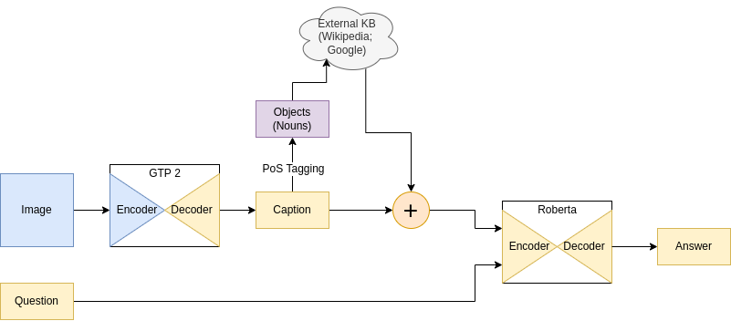

# Visual Question Anwering

Visual Question Answering pipeline that works by converting the image into a
caption and then using a question answering model to predict an answer.



## Architecture

The pipeline for the Visual Question Answering algorithm has two main
components, the image captioning and the text question answering models.

We have used a pre-trained GPT2 model on the task of image captioning. It has
an encoder decoder architecture and works by generating image embeddings using
a Vision Transformer model proposed in (Dosovitskiy et al., 2020). Then the
feature vector is used in the decoder model to generate the caption for the
image.

Next we can fetch the context from an external Knowledge Base (e.g Google,
Wikipedia) to enrich the obtained caption even more. We have used NLP
techniques to obtain the objects from the caption and then retrieve external
knowledge about them. For this task we have used of Part of Speech (PoS)
Tagging. This method allowed us to find the nouns in the image caption which
can be used in a query library such as wikipedia to extract more text
information. Then we continue by concatenating the caption and the external
knowledge information and feed it to the question answering model. This new
method of generating information has the benefit of improving the context of
the model with wikipedia articles that are related to the image setting.

For the Question Answering stage we have used a pre-trained Roberta model on
the SQUAD2 dataset. This model has an encoder decoder architecture. The model
input consists of the word embeddings obtained by concatenating the question
and the context using a tokenizer.

## Pretrained Weights

The ViT GPT2 model is a modified version of the NLP model such that it can
accept an encoder's output. The pre-trained weights of the both models are
loaded, with a set of randomly initialized cross-attention weights. The  model
is trained on 65000 images from the COCO dataset for 1500 steps.

The SQUAD2 dataset is used in training Question Answering models. The main
upgrade over SQUAD is that the newer dataset also includes unanswerable
questions, where the context is not enough for a prediction. A Question
Answering model trained on such a dataset is a good choice for our task since
the captions of the image may not always include the answer and additional
actions are needed. The dataset contains 100,000 questions sampled from SQUAD
and 50,000 questions which are adversarially written such that an answer cannot
be obtained.

## Quick Start

1. Download the OK-VQA dataset into `../data/okvqa`

```console
python data.py
```

2. Run Jupyter to view notebook examples

```console
jupyter notebook
```

3. To run the demo see [streamlit-app](./streamlit-app)
